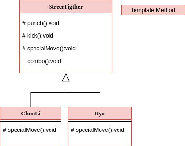

## :bookmark_tabs: Template Method

  This pattern define a template algorithm on superclass, and let the subclass to subscribe the steps.

 
  code is inside the folder `./src`
 
  * [main](https://github.com/nicolaskruger/designPatterns)