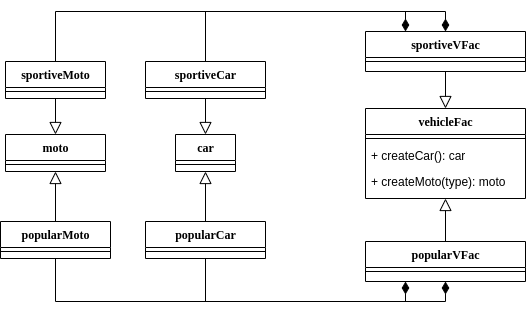
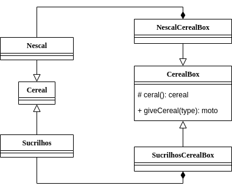
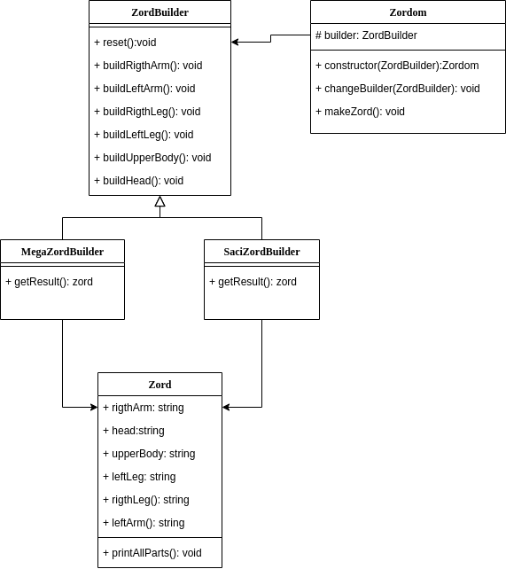
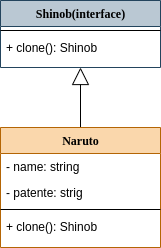
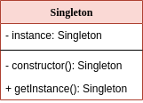

# :notebook_with_decorative_cover: DesignPatterns

## :pushpin: Table of Contents
 * [Description](#book-Description)
 * [Technology](#hammer_and_wrench-Technology)
 * [Require](#bookmark_tabs-Require)
 * [Types of DP](#link-Types-of-Design-Patterns)
 ## :book: Description 
 this is my road to studing design Pattersn spired by [Design Patterns for Humans](https://github.com/kamranahmedse/design-patterns-for-humans)
 each branch is a implmentation in typescript of a especific design patern 
## :hammer_and_wrench: Technology
 * [NodeJS](https://nodejs.org/en/)
 * [typescript](https://www.typescriptlang.org/)
## :bookmark_tabs: Require
* [NodeJS](https://nodejs.org/en/)
 ## :link: Types of Design Patterns
 * [Creational](#building_construction-Creational)
 # :building_construction: Creational
 his focues is how to intatiate an object or group of relates objects.
 * [Abstract Factory](#factory-Abstract-Factory)
 * [Factory Method](#bricks-Factory-Method)
 * [Builder](#houses-Builder)
 * [Prototype](#robot-Prototype)
 * [Singleton](#one-Singleton)
 ## :factory: Abstract Factory
 this pattern is responsable for create certan type of objects lets imgagin one veichle factory, this factory have two another factorys one create sportive vehicles another popular vehicles. 

 * [code](https://github.com/nicolaskruger/designPatterns/tree/abstractFactory)
## 	:bricks: Factory Method
 Factory Method switch operations depends on your concrete object, lets imagin two cereal brand sucrilhos end nescal, bouth have the same method cereal that gives the cereal, but each one gives a specrifica ceral, for that we create one abstracte class CeralBox that give the cereal with a function giveCereal, and this class have one abstract mathod that create the sereal. That abstract method need to be inplmentede for a concrete class.
 
 
 
 * [code](https://github.com/nicolaskruger/designPatterns/tree/FactoryMethod)
  
## :houses: Builder
Builder is a design patern that allow you to buil complex objects step by step.

 
 
 * [code](https://github.com/nicolaskruger/designPatterns/tree/builder)
 
 ## :robot: Prototype
 This pattern allow you to copy existing objects without make your code being dependent of yous classes.
 
 
 
* [code](https://github.com/nicolaskruger/designPatterns/tree/clone)

## :one: Singleton

This pattern ensure that ono class have only one instance.

 
