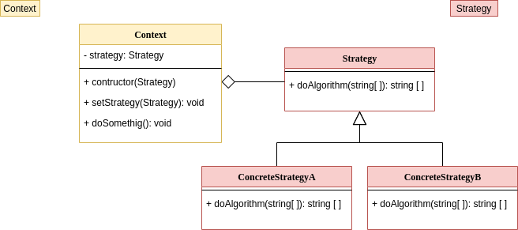

 ## :golfing: Strategy

  this pattern allow you to define one family of algoritms, put this classes sepatreted, and make this objects work together

  
 
  code is inside the folder `./src`
 
  * [main](https://github.com/nicolaskruger/designPatterns)
