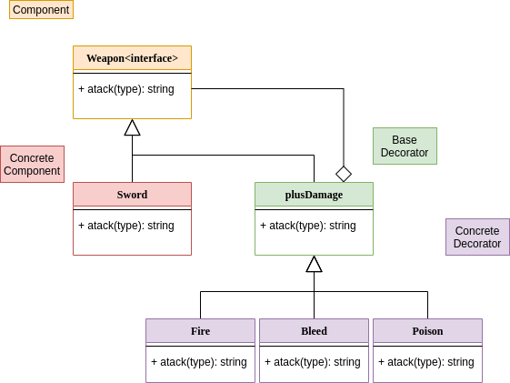
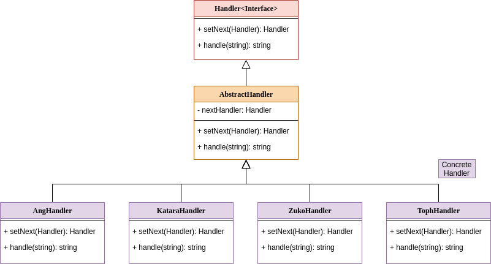

# :notebook_with_decorative_cover: DesignPatterns

## :pushpin: Table of Contents
 * [Description](#book-Description)
 * [Technology](#hammer_and_wrench-Technology)
 * [Require](#bookmark_tabs-Require)
 * [Types of DP](#link-Types-of-Design-Patterns)
 ## :book: Description 
 this is my road to studing design Pattersn spired by [Design Patterns for Humans](https://github.com/kamranahmedse/design-patterns-for-humans)
 each branch is a implmentation in typescript of a especific design patern 
## :hammer_and_wrench: Technology
 * [NodeJS](https://nodejs.org/en/)
 * [typescript](https://www.typescriptlang.org/)
## :bookmark_tabs: Require
* [NodeJS](https://nodejs.org/en/)
 ## :link: Types of Design Patterns
 * [Creational](#building_construction-Creational)
 * [Structural](#classical_building-Structural)
 * [Behavioral](#chains-behavioral)
 # :building_construction: Creational
 his focues is how to intatiate an object or group of relates objects.
 * [Abstract Factory](#factory-Abstract-Factory)
 * [Factory Method](#bricks-Factory-Method)
 * [Builder](#houses-Builder)
 * [Prototype](#robot-Prototype)
 * [Singleton](#one-Singleton)

 # :classical_building: Structural
 This kind of patter explain how to builde classes with big structures, but mainten this flexible and eficient
 
 * [Adapete](#electric_plugadapter)
 * [Bridged](#bridge_at_night-Bridge)
 * [Composite](#deciduous_tree-Composite)
 * [Decorator](#dolls-Decorator)
 * [Facede](#classical_building-Facede)
 * [Flyweight](#balance_scale-Flyweight)
 * [Proxy](#package-Proxy)
 
 # :chains: behavioral

 This patter is linked to algorithms and delegate respnsability responsibility between objects

 * [Chain of Responsibility](#link-Chain-of-Responsibility)
 * [Command](#joystick-Command)
 * [Iterator](#walking_woman-Iterator)
 * [Mediator](#vertical_traffic_light-Mediator)
 
 ## :factory: Abstract Factory
 this pattern is responsable for create certan type of objects lets imgagin one veichle factory, this factory have two another factorys one create sportive vehicles another popular vehicles. 

 * [code](https://github.com/nicolaskruger/designPatterns/tree/abstractFactory)
## 	:bricks: Factory Method
 Factory Method switch operations depends on your concrete object, lets imagin two cereal brand sucrilhos end nescal, bouth have the same method cereal that gives the cereal, but each one gives a specrifica ceral, for that we create one abstracte class CeralBox that give the cereal with a function giveCereal, and this class have one abstract mathod that create the sereal. That abstract method need to be inplmentede for a concrete class.
 
 
 
 * [code](https://github.com/nicolaskruger/designPatterns/tree/FactoryMethod)
  
## :houses: Builder
Builder is a design patern that allow you to buil complex objects step by step.

 
 
 * [code](https://github.com/nicolaskruger/designPatterns/tree/builder)
 
 ## :robot: Prototype
 This pattern allow you to copy existing objects without make your code being dependent of yous classes.
 
 
 
* [code](https://github.com/nicolaskruger/designPatterns/tree/Prototype)

## :one: Singleton

This pattern ensure that one class have only one instance.

 
 
 * [code](https://github.com/nicolaskruger/designPatterns/tree/Singleton)
 ## :electric_plug:	Adapter

 Allow objects with incompatible interfaces co-work toogeter.
 
 
 
  * [code](https://github.com/nicolaskruger/designPatterns/tree/Adapter)
  
  ## :bridge_at_night: Bridge
  
  That patter allow you to split one big class or one arrange of classes in two diferents hierarchy.
  
  
 
 
  * [code](https://github.com/nicolaskruger/designPatterns/tree/Bridge)
  
  ## :deciduous_tree: Composite
  
  This pattern allow you so store your's objects in tree extructure
  
   
   
   * [code](https://github.com/nicolaskruger/designPatterns/tree/Composite)

## :dolls: Decorator

This is a pattern that allow you add new behavior to objects when this are inside other object.

   
   
   * [code](https://github.com/nicolaskruger/designPatterns/tree/Decorator)
   
 ## :classical_building: Facede
 
 Pattern that gives simplificate interface to complex system
 
  
 
 * [code](https://github.com/nicolaskruger/designPatterns/tree/Facede)
 
 ## :balance_scale: Flyweight
 
 This pattern allow you to put more objects on less RAM space. By sharyng the comun state of multiples objects.
 
  
 
 * [code](https://github.com/nicolaskruger/designPatterns/tree/Flyweight)
  
  ## :package: Proxy
 
 This pattern allow you to do things before and/or after one request
 
  
 
 * [code](https://github.com/nicolaskruger/designPatterns/tree/Proxy)
 
 ## :link: Chain of Responsibility
 
 This pattern allow a lot of objects to deal one request without couple the sender class to concrete destiny class. The chain could be composed dinamicaly in execution time.
 
  
 
 * [code](https://github.com/nicolaskruger/designPatterns/tree/Chain)
 
 
  ## :joystick: Command
 
 This pattern is used to uncouple GUI end the logic of the system
 
  
 
 * [code](https://github.com/nicolaskruger/designPatterns/tree/Command)
 
## :walking_woman: Iterator
 
 Allow you to go through elemets of one colection without show his representation
 
   
 
 * [code](https://github.com/nicolaskruger/designPatterns/tree/Iterator)
 
 ## :vertical_traffic_light: Mediator
 
 This pattern allow you to reduce dependences between objects.
 
  
 
 * [code](https://github.com/nicolaskruger/designPatterns/tree/Mediator)
